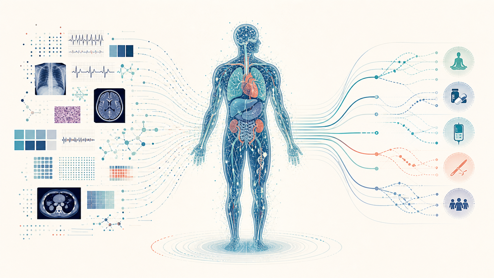
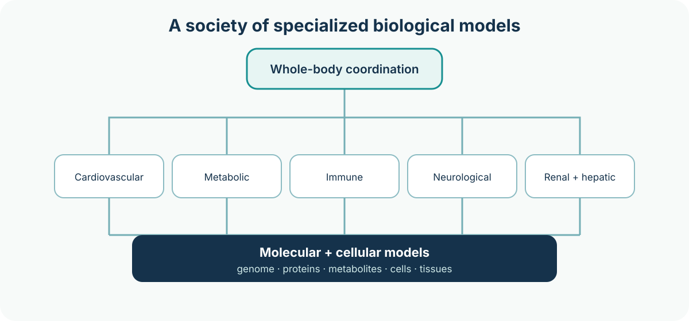
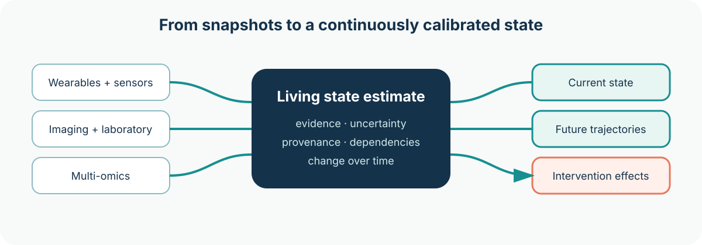
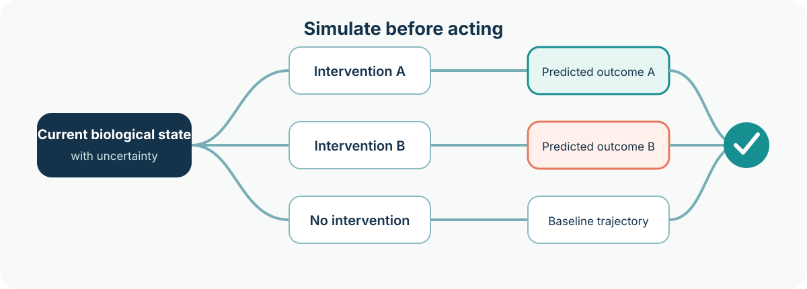
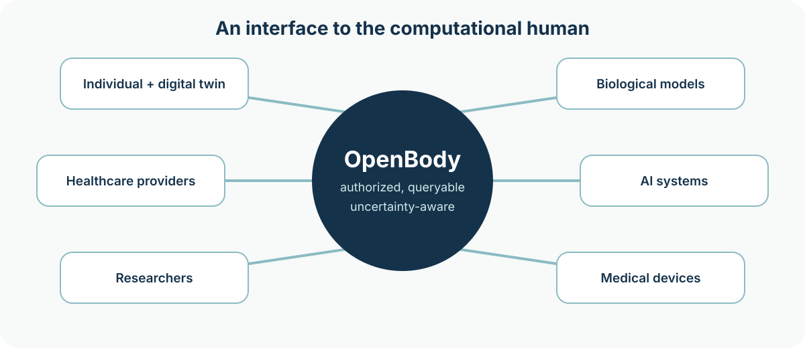
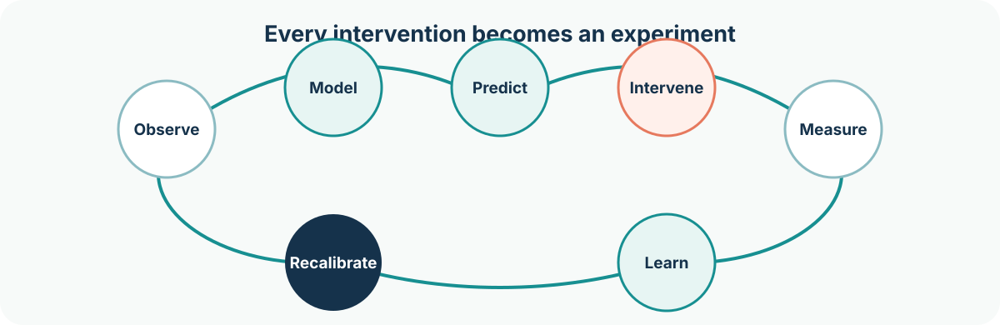

For decades, healthcare has been built around the medical record.

The electronic health record is essentially a history of what happened: consultations, laboratory results, images, diagnoses, prescriptions, and procedures. It organizes information so that clinicians can understand a patient and decide what to do next.

But the most important model of the patient is not actually in the EHR.

**It exists in the clinician.**

A physician takes fragments of information, combines them with medical knowledge and experience, constructs a mental model of what is happening inside the body, considers possible explanations and interventions, and makes a decision. The EHR records the evidence and conclusions and coordinates the resulting workflow.

I believe this architecture is about to change fundamentally.

## The health record will no longer be the center

The central computational object of future healthcare will not be the electronic health record.

> **It will be an executable model of the human being.**

Human biology can increasingly be represented as a hierarchy of interacting systems: genome, epigenome, proteins, metabolites, cells, tissues, organs, physiological systems, and, ultimately, the whole organism.

These systems are constantly communicating through biochemical, neural, endocrine, immune, circulatory, and physical processes. Health and disease emerge from their interactions.

Trying to represent all of this with a single monolithic AI model is unlikely to be the right architecture.

Instead, imagine the human body represented by a society of specialized biological models.

A cardiovascular model understands electrophysiology, hemodynamics, vascular biology, and cardiac mechanics. A metabolic model understands glucose regulation, insulin dynamics, hepatic metabolism, and energy balance. Kidney, liver, immune, endocrine, neurological, musculoskeletal, and gastrointestinal systems have their own specialized models.

Below them are increasingly detailed molecular and cellular models. Above them is a whole-body model capable of reasoning about how these systems interact.

It is less like one artificial neural network and more like a **Society of Organs**.

## A federation of biological intelligence

No single hospital, technology company, or research institution needs to build all of these models.

Specialized laboratories could develop competing models for individual biological systems, much as specialized AI laboratories develop foundation models today.

An individual might use the best available cardiovascular model from one research group, a metabolic model from another, and a genomic interpretation model from a third. Better models could replace older ones as science advances, without replacing the entire system.

The computational representation of the individual therefore becomes a federation of biological models.

> **A biological model is not yet a digital twin.** It becomes a digital twin when it is continuously calibrated against a particular human being.

## From occasional measurements to continuous observation

Historically, medicine has observed the body intermittently.

A blood test provides a snapshot. A consultation captures a moment. An ECG records a few seconds or minutes. An MRI provides an image at one point in time.

That is changing.

Wearable ECG, continuous glucose monitoring, blood pressure, sleep, movement, temperature, EEG, imaging, and laboratory measurements are steadily increasing the resolution with which we can observe human physiology. Genomics, proteomics, and metabolomics add deeper biological layers. Over time, continuous or near-continuous molecular sensing could extend this much further.

Every new observation can update the state of the digital twin.

The result is fundamentally different from an electronic health record.

| Electronic health record | Human digital twin |
|---|---|
| Records that a glucose measurement of 145 mg/dL occurred yesterday | Maintains an evolving estimate of the person’s metabolic state |
| Organizes observations and conclusions | Connects observations, models, uncertainty, and provenance |
| Primarily describes what happened | Estimates what is happening now and what may happen next |

The difference is between **recording the past** and **maintaining an evolving model of the present**.

## Healthcare becomes counterfactual

Once we have sufficiently capable models, the questions medicine can ask begin to change.

Today, one of the central questions is:

> **What disease does this person have?**

That remains important. But it becomes part of a larger set of questions:

1. What state is this biological system currently in?
2. What mechanisms best explain that state?
3. Where is it likely to go from here?
4. What would happen if we intervened?
5. What would happen under intervention A instead of B?
6. What sequence of interventions has the greatest probability of moving this system toward a healthier state?

This is a shift from predominantly diagnostic medicine toward increasingly predictive and counterfactual medicine.

Diagnosis does not disappear. But it becomes one useful representation derived from a richer underlying model rather than the organizing principle of the entire architecture.

## The patient carries the model

There is a useful, although imperfect, analogy with modern automobiles.

Cars no longer rely entirely on a mechanic inferring their internal condition from symptoms. They continuously measure themselves, maintain internal state, detect abnormalities, and expose standardized diagnostic interfaces.

Owners can handle simple maintenance themselves. Specialists and service centers intervene when expensive equipment or expertise is required.

Human beings are, of course, incomparably more complex than cars. Biology is probabilistic, adaptive, and only partially understood.

But the architectural principle is powerful:

> **The individual should carry the continuously updated computational representation of themselves.**

When someone arrives at a hospital, the healthcare system should not have to reconstruct that person from years of fragmented records.

With the individual’s authorization, it should be able to query their computational model.

## OpenBody: an interface to the computational human

I call this interface **OpenBody**.

OpenBody is not another electronic health-record format.

FHIR describes healthcare information. DICOM describes medical imaging. Other standards describe measurements, genomic information, and specific forms of clinical data.

OpenBody sits above them.

It describes the current computational state of a human being: the evidence supporting that state, the models that produced it, their uncertainty, dependencies between biological systems, predicted trajectories, executable counterfactuals, and the outcomes of previous interventions.

It could become an interoperability layer connecting people, biological digital twins, AI systems, healthcare providers, researchers, and medical devices.

A hospital receiving a patient should eventually be able—with appropriate authorization—to ask:

- What is currently known about this person’s cardiovascular state?
- What evidence supports that assessment?
- Which models produced it?
- How uncertain are those conclusions?
- What has materially changed during the last 24 hours?
- Which interventions have already been simulated?
- Which interventions were actually performed?
- How did the observed response compare with the predicted response?
- Which conclusions are direct observations, statistical associations, causal estimates, or mechanistic simulations?
- Which questions cannot currently be answered safely?

That final question matters enormously.

> A trustworthy digital twin must represent not only what it believes, but **what it does not know—and why**.

## This does not remove the clinician

The digital twin does not replace clinical expertise.

It changes where clinical reasoning begins.

Instead of spending much of the clinical encounter reconstructing the patient from a fragmented historical record, the clinician can begin with a continuously calibrated computational representation of the person.

The physician can inspect it, challenge it, interrogate its evidence, test alternative hypotheses, add observations, and independently interpret its conclusions.

Clinical expertise becomes more powerful because the starting point is richer.

And the relationship should work in both directions.

Every intervention becomes an experiment from which the model can learn.

The system predicts a response. An intervention occurs. The body responds. New observations arrive. Prediction and reality are compared. The model is recalibrated.

## Beyond the EHR

The EHR will not simply disappear. Records, provenance, consent, auditability, and clinical documentation will remain essential.

But their role changes.

The future EHR becomes less like a medical filing cabinet and more like a runtime for the human digital twin.

- **The medical record** becomes the evidence.
- **The digital twin** becomes the model.
- **AI** becomes the reasoning interface.
- **OpenBody** becomes the interoperability layer.

And healthcare evolves from episodically documenting disease toward continuously understanding, predicting, maintaining, and restoring the state of the human organism.

That is the transition I believe lies ahead:

> **From electronic health records to executable human models.**
